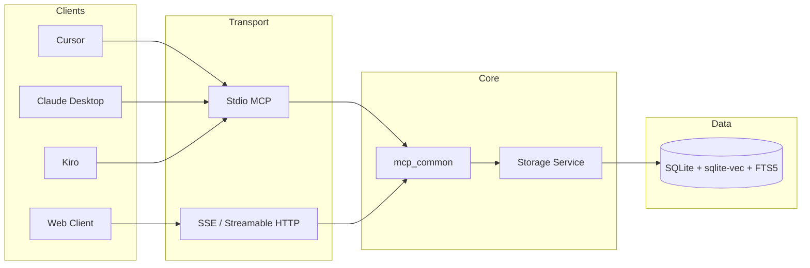

# mem-mesh

[](https://pypi.org/project/mem-mesh/)
[](https://www.python.org/downloads/)
[](https://opensource.org/licenses/MIT)
[](https://modelcontextprotocol.io/)

> Persistent memory for AI agents — hybrid vector + FTS5 search, pin-based session tracking, and NLI conflict detection. Zero external dependencies.

[한국어](./README.md) · [Quick Start](#quick-start) · [MCP Setup](#mcp-setup) · [MCP Tools](#mcp-tools-15) · [Session & Pins](#session--pins) · [Architecture](#architecture) · [Docker](#docker) · [Contributing](#contributing)

---

## Why mem-mesh?

Most MCP memory servers are glorified key-value stores. mem-mesh is built for how AI agents actually work — sessions with multiple steps, decisions that need to survive reboots, and cross-machine context that has to stay coherent.

| Differentiator | What it means |
|---|---|
| **Pin lifecycle** | Lightweight kanban inside every session: `pin_add` → `pin_complete` → `pin_promote`. No other MCP memory server has this. |
| **Hybrid search** | sqlite-vec vector embeddings + FTS5 full-text fused with Reciprocal Rank Fusion (RRF). Korean n-gram optimized out of the box. |
| **NLI conflict detection** | 2-stage pipeline: vector similarity pre-filter → mDeBERTa NLI model catches contradictory memories before they're stored. |
| **4-Tier Smart Expand** | `session_resume(expand="smart")` uses an importance × status matrix to load only what matters — ~60% token savings. |
| **Zero external services** | Single SQLite file. `pip install mem-mesh` and you're running. No Postgres, no Redis, no cloud. |
| **Dual MCP transport** | stdio (Cursor, Claude Desktop, Kiro) + Streamable HTTP/SSE (MCP spec 2025-03-26). |
| **25+ client auto-detection** | Identifies the calling IDE/AI platform from MCP handshake or User-Agent. |
| **Batch operations** | Pack multiple memory ops into one round-trip: 30–50% token savings. |

---

## Features

- **Memory CRUD** — `add`, `search`, `context`, `update`, `delete`
- **Hybrid search** — sentence-transformers vectors + FTS5 RRF fusion, Korean n-gram support
- **Session & pins** — short-lived work tracking with importance-based promotion to permanent memory
- **Memory relations** — `link`, `unlink`, `get_links` across 7 relation types
- **Conflict detection** — mDeBERTa NLI prevents storing contradictory facts
- **Batch operations** — 30–50% fewer tokens per multi-op workflow
- **Web dashboard** — FastAPI REST API + real-time UI at `localhost:8000`

---

## Quick Start

```bash
# Install
pip install mem-mesh
# or from source:
git clone https://github.com/JINWOO-J/mem-mesh && cd mem-mesh && pip install -e .

# Configure (optional)
cp .env.example .env

# Run the web server
python -m app.web --reload
```

Open http://localhost:8000. The SSE MCP endpoint is at `http://localhost:8000/mcp/sse`.

---

## MCP Setup

### Stdio (recommended for local AI tools)

Add this to your MCP config file. Define it once and share across tools.

```json
{
  "mcpServers": {
    "mem-mesh": {
      "command": "python",
      "args": ["-m", "app.mcp_stdio"],
      "cwd": "/absolute/path/to/mem-mesh",
      "env": {
        "MCP_LOG_LEVEL": "INFO"
      }
    }
  }
}
```

**Config file locations by tool:**

| Tool | Config file |
|---|---|
| Cursor | `.cursor/mcp.json` |
| Claude Desktop | `~/Library/Application Support/Claude/claude_desktop_config.json` |
| Kiro | `~/.kiro/settings/mcp.json` |

> For a more stable stdio implementation, switch args to `["-m", "app.mcp_stdio_pure"]` (pure MCP protocol, no FastMCP dependency).

### Stdio vs SSE

| | Stdio | SSE |
|---|---|---|
| Best for | Cursor, Claude Desktop, Kiro, any local AI tool | Web-based AI clients, custom integrations |
| Run | `python -m app.mcp_stdio` | `python -m app.web` → `http://localhost:8000/mcp/sse` |
| Protocol | stdio JSON-RPC | Streamable HTTP (MCP 2025-03-26) |

---

## MCP Tools (15)

| Tool | Description | Key parameters |
|---|---|---|
| `add` | Store a memory | `content`, `project_id`, `category`, `tags` |
| `search` | Hybrid vector + FTS5 search | `query`, `project_id`, `category`, `limit`, `recency_weight`, `response_format` |
| `context` | Retrieve memories surrounding a given memory | `memory_id`, `depth`, `project_id` |
| `update` | Edit a memory | `memory_id`, `content`, `category`, `tags` |
| `delete` | Remove a memory | `memory_id` |
| `stats` | Usage statistics | `project_id`, `start_date`, `end_date` |
| `link` | Create a typed relation between memories | `source_id`, `target_id`, `relation_type` |
| `unlink` | Remove a relation | `source_id`, `target_id` |
| `get_links` | Query relations | `memory_id`, `relation_type`, `direction` |
| `pin_add` | Add a short-lived work-tracking pin | `content`, `project_id`, `importance`, `tags` |
| `pin_complete` | Mark a pin done; optionally promote to permanent memory | `pin_id`, `promote`, `category` |
| `pin_promote` | Promote an already-completed pin to permanent memory | `pin_id`, `category` |
| `session_resume` | Restore context from the previous session | `project_id`, `expand`, `limit` |
| `session_end` | Close a session with a summary | `project_id`, `summary`, `auto_complete_pins` |
| `batch_operations` | Execute multiple ops in one call | `operations` (array of add/search/pin_add/pin_complete) |

**`search` response formats:** `minimal` | `compact` | `standard` | `full`

---

## Search

mem-mesh runs two retrieval engines in parallel and merges results with Reciprocal Rank Fusion:

- **Vector** — `sentence-transformers/all-MiniLM-L6-v2` (384-dim) by default; E5 models supported
- **FTS5** — SQLite full-text search with n-gram tokenization for CJK languages
- **RRF fusion** — balances semantic similarity and keyword precision
- **Quality filters** — noise removal, intent analysis, vector pre-filter overfetch to improve recall

---

## Session & Pins

### Session lifecycle

```
session_resume(project_id, expand="smart")  →  work  →  session_end(project_id, summary)
```

- `session_resume` restores incomplete pins and context from the previous session. Stale pins are auto-closed. `expand="smart"` applies an importance × status matrix that cuts token usage by ~60%.
- `session_end` records a summary and closes the session. If the session terminates abnormally, the next `session_resume` automatically recovers open pins.

### Pin lifecycle

Pins are **the unit of work inside a session**. Track code changes, implementations, and configuration work as pins — not in permanent memory.

```
pin_add(content, project_id)  →  do the work  →  pin_complete(pin_id, promote=True)
                                                   # promote=True completes and promotes in one call
```

**Status flow:** `open` (planned, not started) → `in_progress` (active; **default on pin_add**) → `completed`

Multi-step work can pre-register later steps as `open` pins, then activate them one at a time.

**Auto-stale cleanup** (triggered on `session_resume`):
- `in_progress` pins older than 7 days → auto-completed
- `open` pins older than 30 days → auto-completed

**When to pin:** only when files change. Questions, explanations, and read-only lookups do not need pins. Multi-step tasks get one pin per step.

**Importance levels:**
| Level | Use for |
|---|---|
| `5` | Architecture decisions, core design changes |
| `3–4` | Feature implementations, significant fixes |
| `1–2` | Minor edits, typo fixes |
| omit | Auto-inferred from content |

**Promote:** `pin_complete(pin_id, promote=True)` completes and promotes to permanent memory in one call. To promote after the fact: `pin_promote(pin_id)`.

**Client detection:** In HTTP mode, the calling client is identified from the MCP initialize handshake or User-Agent header (25+ IDE/AI platforms supported). In stdio mode, set `MEM_MESH_CLIENT` in the environment.

### AI agent checklist

```
1. Session start   → session_resume(project_id, expand="smart")
2. Past context    → search() before coding if referencing previous decisions
3. Track work      → pin_add → pin_complete (promote=True to merge into memory)
4. Permanent store → decision / bug / incident / idea / code_snippet only
5. Session end     → session_end(project_id, summary, auto_complete_pins=True)
6. Never store     → API keys / tokens / passwords / PII
```

> **Principle:** Hooks are read-only signals. All pin creation, completion, and promotion decisions are made by the LLM with full context.

---

## Memory Relations

Seven relation types: `related` | `parent` | `child` | `supersedes` | `references` | `depends_on` | `similar`

`get_links` direction: `outgoing` | `incoming` | `both`

---

## Configuration

| Variable | Description | Default |
|---|---|---|
| `MEM_MESH_DATABASE_PATH` | SQLite database path | `./data/memories.db` |
| `MEM_MESH_EMBEDDING_MODEL` | Embedding model name | `all-MiniLM-L6-v2` |
| `MEM_MESH_EMBEDDING_DIM` | Vector dimensions | `384` |
| `MEM_MESH_SERVER_PORT` | Web server port | `8000` |
| `MEM_MESH_SEARCH_THRESHOLD` | Minimum similarity score | `0.5` |
| `MEM_MESH_USE_UNIFIED_SEARCH` | Enable hybrid search | `true` |
| `MEM_MESH_ENABLE_KOREAN_OPTIMIZATION` | Korean n-gram FTS | `true` |
| `MCP_LOG_LEVEL` | MCP server log level | `INFO` |
| `MCP_LOG_FILE` | MCP log output file | (none) |

See `.env.example` for the full list.

---

## Web Dashboard

- **Dashboard:** http://localhost:8000
- **API docs (Swagger):** http://localhost:8000/docs
- **Health check:** http://localhost:8000/health

---

## Architecture



### Directory structure

```
mem-mesh/
├── app/
│   ├── core/              # DB, embeddings, services, schemas
│   ├── mcp_common/        # Shared MCP tools, dispatcher, batch
│   ├── mcp_stdio/         # FastMCP stdio server
│   ├── mcp_stdio_pure/    # Pure MCP stdio server
│   └── web/               # FastAPI (dashboard, SSE MCP, OAuth, WebSocket)
├── static/                # Frontend (Vanilla JS, Web Components)
├── tests/                 # pytest
├── scripts/               # Migration and benchmark scripts
├── docs/rules/            # AI agent rule modules
├── data/                  # memories.db
└── logs/
```

---

## Docker

```bash
# Build and start
make quickstart
# or step by step:
make docker-build && make docker-up

# Open http://localhost:8000
```

---

## Development

```bash
# Install dev dependencies
pip install -e ".[dev]"

# Run tests
python -m pytest tests/ -v

# Format and lint
black app/ tests/
ruff check app/ tests/

# Check embedding migration status
python scripts/migrate_embeddings.py --check-only
```

---

## Documentation

- [CLAUDE.md](./CLAUDE.md) — AI tool checklist (MUST/SHOULD/MAY rules, security policy)
- [AGENTS.md](./AGENTS.md) — Project context, Golden Rules, Context Map, session management details

### AI agent rule modules (`docs/rules/`)

| File | Purpose |
|---|---|
| [DEFAULT_PROMPT.md](./docs/rules/DEFAULT_PROMPT.md) | **Default behavior rules** — copy into your project's CLAUDE.md or Cursor rules |
| [all-tools-full.md](./docs/rules/all-tools-full.md) | Full rules for all 15 tools |
| [mem-mesh-ide-prompt.md](./docs/rules/mem-mesh-ide-prompt.md) | Compact IDE prompt (~300 tokens) |
| [modules/quick-start.md](./docs/rules/modules/quick-start.md) | 5-minute quick start |
| [modules/](./docs/rules/modules/) | Feature modules: core, search, pins, relations, batch |

### Architecture docs

- [app/core/AGENTS.md](./app/core/AGENTS.md) — Core service internals
- [app/mcp_common/AGENTS.md](./app/mcp_common/AGENTS.md) — MCP common layer

---

## Contributing

1. Open an issue or pull request
2. Follow `black` and `ruff` formatting
3. Add tests for any new behavior

---

## License

[MIT](./LICENSE)
