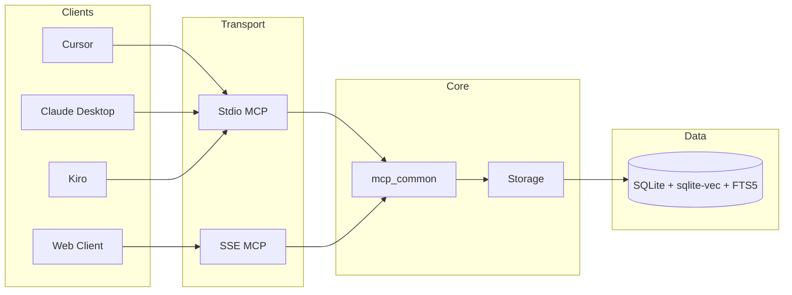

# mem-mesh

[](https://pypi.org/project/mem-mesh/)
[](https://www.python.org/downloads/)
[](https://opensource.org/licenses/MIT)
[](https://modelcontextprotocol.io/)

> AI 에이전트를 위한 중앙 집중식 메모리 시스템 — 벡터 검색과 맥락 조회로 실시간 기억 저장·조정

[English](./README.md)

## 목차

- [mem-mesh란?](#mem-mesh란) · [Quick Start](#quick-start) · [MCP 설정](#mcp-설정) · [MCP 도구](#mcp-도구) · [검색](#검색) · [세션 & 핀](#세션--핀) · [메모리 관계](#메모리-관계) · [웹 대시보드](#웹-대시보드) · [설정](#설정) · [Docker](#docker) · [개발](#개발) · [아키텍처](#아키텍처) · [문서](#문서)

---

## mem-mesh란?

mem-mesh는 AI 도구(Cursor, Claude Desktop, Kiro 등)가 **벡터 검색**과 **맥락 조회**를 활용해 작업 중 생성되는 메모리를 중앙에서 관리하는 시스템입니다. MCP(Model Context Protocol)를 통해 15개의 도구로 메모리 추가, 검색, 세션·핀 관리, 관계 연결, 배치 연산을 지원합니다.

### 주요 기능

- **메모리 CRUD**: add, search, context, update, delete
- **하이브리드 검색**: 벡터 + FTS5 RRF 융합, 한국어 n-gram 최적화
- **세션 & 핀**: 단기 작업 추적, 중요도 기반 영구 메모리 승격
- **메모리 관계**: link, unlink, get_links (7가지 관계 타입)
- **배치 연산**: 30–50% 토큰 절감
- **웹 대시보드**: FastAPI 기반 REST API + 실시간 UI

---

## Quick Start

### 사전 요구사항

mem-mesh는 `sqlite-vec` 확장을 런타임에 로드하므로, Python의 `sqlite3` 모듈이 **loadable extension** 을 지원해야 합니다.

**macOS + pyenv 사용자**: pyenv 의 기본 빌드는 extension loading이 꺼져 있어 `Migration failed: no such module: vec0` 오류가 발생합니다. 다음 중 하나를 선택하세요.

```bash
# 옵션 A (권장): Homebrew sqlite3 와 함께 Python 재빌드
brew install sqlite3
SQLITE_PREFIX="$(brew --prefix sqlite3)"
PYTHON_CONFIGURE_OPTS="--enable-loadable-sqlite-extensions" \
LDFLAGS="-L${SQLITE_PREFIX}/lib" \
CPPFLAGS="-I${SQLITE_PREFIX}/include" \
CFLAGS="-I${SQLITE_PREFIX}/include" \
  pyenv install 3.13 --force
pyenv rehash

# 옵션 B: pysqlite3 바이너리 휠로 우회 (코드의 fallback 자동 사용)
pip install pysqlite3-binary
```

Linux 배포판 Python, Docker 이미지, conda Python 은 일반적으로 extension loading 이 활성화돼 있어 추가 조치가 필요 없습니다.

### 설치 및 실행

```bash
# 1. 클론 및 설치
git clone https://github.com/x-mesh/mem-mesh
cd mem-mesh
pip install -e .

# 2. 환경 설정 (선택)
cp .env.example .env

# 3. 웹 서버 실행
python -m app.web --reload
```

브라우저에서 http://localhost:8000 접속. SSE MCP 엔드포인트: `http://localhost:8000/mcp/sse`

---

## MCP 설정

### Stdio (AI 도구 연동)

AI 도구에서 mem-mesh를 사용하려면 MCP 설정 파일에 다음을 추가하세요.

**권장 설정 (한 번만 정의):**

```json
{
  "mcpServers": {
    "mem-mesh": {
      "command": "python",
      "args": ["-m", "app.mcp_stdio"],
      "cwd": "/절대/경로/to/mem-mesh",
      "env": {
        "MCP_LOG_LEVEL": "INFO"
      }
    }
  }
}
```

### 도구별 설정 파일 위치

| 도구 | 설정 파일 |
|------|-----------|
| Cursor | `.cursor/mcp.json` |
| Claude Desktop | `~/Library/Application Support/Claude/claude_desktop_config.json` |
| Kiro | `~/.kiro/settings/mcp.json` |

### Stdio vs SSE

| 항목 | Stdio | SSE |
|------|-------|-----|
| 사용처 | Cursor, Claude, Kiro 등 로컬 AI 도구 | 웹 기반 AI, 커스텀 클라이언트 |
| 실행 | `python -m app.mcp_stdio` | `python -m app.web --reload` 후 `http://localhost:8000/mcp/sse` |
| 프로토콜 | stdio JSON-RPC | Streamable HTTP (2025-03-26) |

**Pure MCP 프로토콜** (더 안정적인 stdio): `args`를 `["-m", "app.mcp_stdio_pure"]`로 변경

---

## MCP 도구 (15개)

| 도구 | 설명 | 주요 파라미터 |
|------|------|---------------|
| `add` | 메모리 추가 | content, project_id, category, tags |
| `search` | 하이브리드 검색 | query, project_id, category, limit, recency_weight, response_format |
| `context` | 메모리 주변 맥락 조회 | memory_id, depth, project_id |
| `update` | 메모리 수정 | memory_id, content, category, tags |
| `delete` | 메모리 삭제 | memory_id |
| `stats` | 통계 조회 | project_id, start_date, end_date |
| `link` | 메모리 간 관계 생성 | source_id, target_id, relation_type |
| `unlink` | 관계 제거 | source_id, target_id |
| `get_links` | 관계 조회 | memory_id, relation_type, direction |
| `pin_add` | 단기 작업 핀 추가 | content, project_id, importance, tags |
| `pin_complete` | 핀 완료 (promote=true로 승격 병합) | pin_id, promote, category |
| `pin_promote` | 핀을 영구 메모리로 승격 | pin_id, category |
| `session_resume` | 프로젝트 세션 재개 | project_id, expand, limit |
| `session_end` | 세션 종료 | project_id, summary, auto_complete_pins |
| `batch_operations` | 다중 연산 (토큰 절감) | operations (add/search/pin_add/pin_complete 배열) |

**search** `response_format`: `minimal` | `compact` | `standard` | `full`

---

## 검색

- **하이브리드**: 벡터(sentence-transformers) + FTS5 RRF 융합
- **한국어**: n-gram FTS, E5 모델 prefix, sigmoid 정규화
- **품질**: 노이즈 필터, 의도 분석, 벡터 pre-filter overfetch
- **임베딩**: 기본 `all-MiniLM-L6-v2` (384차원), E5 모델 지원

---

## 세션 & 핀

### 세션 생명주기

```
session_resume(project_id, expand="smart")  →  작업  →  session_end(project_id, summary)
```

- `session_resume`: 이전 세션의 미완료 핀과 맥락을 복원. Stale 핀 자동 정리 포함. `expand="smart"`는 중요도×상태 기반 선택적 로드로 ~60% 토큰 절감.
- `session_end`: 완료 작업 요약과 함께 세션 마감. 비정상 종료 시 다음 `session_resume`이 미완료 핀을 자동 복원.

### 핀(Pin) 생명주기

핀은 세션 내 **작업 추적 단위**입니다. AI 에이전트가 코드 변경, 구현, 설정 작업 시 핀으로 추적합니다.

```
pin_add(content, project_id)  →  작업 수행  →  pin_complete(pin_id, promote=true)
                                                 (promote=true로 완료+승격을 한 번에 처리)
```

**상태(status):** `open`(계획됨, 미착수) → `in_progress`(작업 중, **pin_add 기본값**) → `completed`(완료)
- 다단계 작업에서 나중 작업은 `open` 상태로 미리 등록 가능

**Stale 자동 정리:** `session_resume` 호출 시 오래된 핀을 자동 완료 처리
- `in_progress` 상태 7일 경과 → `completed`
- `open` 상태 30일 경과 → `completed`

**핀 생성 기준:** 파일이 변경되는 작업만 pin. 질문·설명·조회는 pin 불필요. 다단계 작업은 단계별 pin.

**중요도(importance):**
- `5`: 아키텍처 결정, 핵심 설계 변경
- `3–4`: 기능 구현, 주요 수정
- `1–2`: 단순 수정, 오타 수정
- 생략 시 내용 기반 자동 추정

**승격(promote):** `pin_complete(pin_id, promote=true)`로 완료와 승격을 한 번에 처리. 이미 완료된 핀은 `pin_promote`로 별도 승격 가능.

**클라이언트 감지:** HTTP 모드에서 MCP initialize 핸드셰이크 또는 User-Agent 헤더로 자동 감지 (25+ IDE/AI 플랫폼 지원). Stdio 모드에서는 `MEM_MESH_CLIENT` 환경변수 사용.

### AI 에이전트 사용 체크리스트

```
1. 세션 시작  → session_resume(project_id, expand="smart")
2. 과거 맥락  → 이전 결정/작업 언급 시 search() 후 코딩
3. 작업 추적  → pin_add → pin_complete(promote=true로 승격 병합 가능)
4. 영구 저장  → decision / bug / incident / idea / code_snippet 만
5. 세션 종료  → session_end(project_id, summary, auto_complete_pins=true)
6. 보안 금지  → API키 / 토큰 / 비밀번호 / PII 절대 저장 금지
```

> **원칙**: Hook은 상태 표시/리마인더만 수행(읽기 전용). 모든 핀 생성·완료·승격은 AI(LLM)가 문맥을 이해하고 판단합니다.

- **보안**: API키, 토큰, PII는 메모리에 저장되지 않으며, 민감 값은 `<REDACTED>` 치환

---

## 메모리 관계

- **link**: `related` | `parent` | `child` | `supersedes` | `references` | `depends_on` | `similar`
- **get_links**: `direction`: `outgoing` | `incoming` | `both`

---

## 웹 대시보드

- **URL**: http://localhost:8000
- **API 문서**: http://localhost:8000/docs
- **헬스체크**: http://localhost:8000/health

---

## 설정

| 변수 | 설명 | 기본값 |
|------|------|--------|
| `MEM_MESH_DATABASE_PATH` | SQLite DB 경로 | `./data/memories.db` |
| `MEM_MESH_EMBEDDING_MODEL` | 임베딩 모델 | `all-MiniLM-L6-v2` |
| `MEM_MESH_EMBEDDING_DIM` | 벡터 차원 | `384` |
| `MEM_MESH_SERVER_PORT` | 웹 서버 포트 | `8000` |
| `MEM_MESH_SEARCH_THRESHOLD` | 검색 임계값 | `0.5` |
| `MEM_MESH_USE_UNIFIED_SEARCH` | 통합 검색 활성화 | `true` |
| `MEM_MESH_ENABLE_KOREAN_OPTIMIZATION` | 한국어 최적화 | `true` |
| `MCP_LOG_LEVEL` | MCP 로그 레벨 | `INFO` |
| `MCP_LOG_FILE` | MCP 로그 파일 | (미설정) |

전체 옵션은 `.env.example` 참조.

---

## Docker

```bash
# 빌드 및 실행
make quickstart
# 또는: make docker-build && make docker-up

# 접속: http://localhost:8000
```

---

## 개발

```bash
# 의존성 (개발)
pip install -e ".[dev]"

# 테스트
python -m pytest tests/ -v

# 포맷/린트
black app/ tests/
ruff check app/ tests/

# 마이그레이션 확인
python scripts/migrate_embeddings.py --check-only
```

---

## 아키텍처



### 디렉토리 구조

```
mem-mesh/
├── app/
│   ├── core/              # DB, 임베딩, 서비스, 스키마
│   ├── mcp_common/        # 공통 MCP 도구, 디스패처, 배치
│   ├── mcp_stdio/         # FastMCP stdio 서버
│   ├── mcp_stdio_pure/    # Pure MCP stdio 서버
│   └── web/               # FastAPI (대시보드, SSE MCP, OAuth, WebSocket)
├── static/                # 프론트엔드 (Vanilla JS, Web Components)
├── tests/                 # pytest
├── scripts/               # 마이그레이션, 벤치마크
├── docs/rules/            # AI 에이전트 규칙 모듈
├── data/                  # memories.db
└── logs/
```

---

## 문서

- [CLAUDE.md](./CLAUDE.md) — AI 도구 Checklist (MUST/SHOULD/MAY 규칙, 보안 정책)
- [AGENTS.md](./AGENTS.md) — 프로젝트 컨텍스트, Golden Rules, Context Map, 세션 관리 상세

### AI 에이전트 규칙 (docs/rules/)

| 문서 | 용도 |
|------|------|
| [DEFAULT_PROMPT.md](./docs/rules/DEFAULT_PROMPT.md) | **기본 행동 규칙** — 프로젝트 CLAUDE.md/Cursor rules에 복사하여 사용 |
| [all-tools-full.md](./docs/rules/all-tools-full.md) | 전체 규칙 (15개 도구, 검색/저장/세션/관계/배치) |
| [mem-mesh-ide-prompt.md](./docs/rules/mem-mesh-ide-prompt.md) | IDE용 컴팩트 프롬프트 (~300 토큰) |
| [modules/quick-start.md](./docs/rules/modules/quick-start.md) | 5분 빠른 시작 |
| [modules/](./docs/rules/modules/) | 기능별 모듈 (core, search, pins, relations 등) |

### 아키텍처 문서

- [app/core/AGENTS.md](./app/core/AGENTS.md) — Core 서비스
- [app/mcp_common/AGENTS.md](./app/mcp_common/AGENTS.md) — MCP 공통 로직

---

## 기여

1. 이슈/PR 생성
2. `black`, `ruff` 준수
3. 테스트 추가

자세한 내용은 [CONTRIBUTING.md](./CONTRIBUTING.md)를, 릴리즈 히스토리는 [CHANGELOG.md](./CHANGELOG.md)를 참조하세요.

---

## 라이선스

[MIT](./LICENSE)
